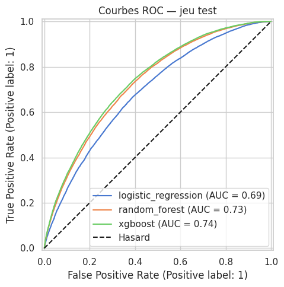
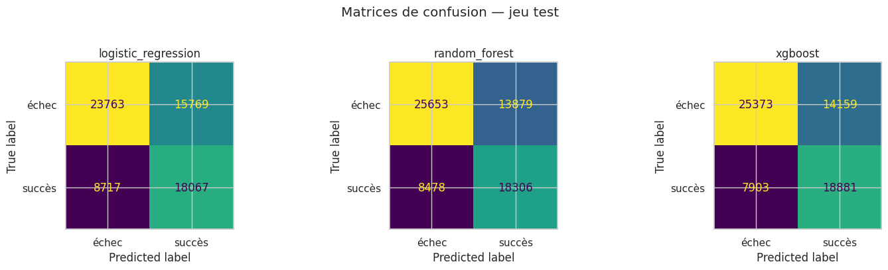
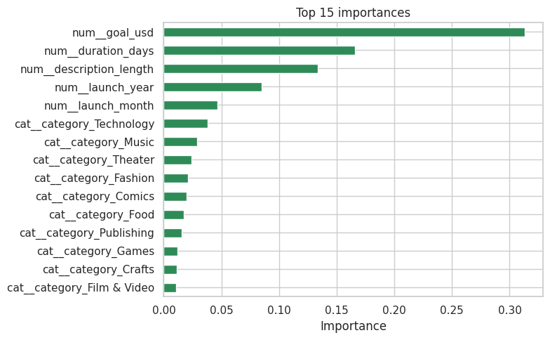

# Kickstarter Success Predictor

Predicts whether a Kickstarter campaign will succeed or fail, from a handful of
details known before launch: category, funding goal, duration, country,
description length and launch date.

Requires [uv](https://docs.astral.sh/uv/getting-started/installation/) — install with
`curl -LsSf https://astral.sh/uv/install.sh | sh`.

## Setup

```bash
uv sync
```

Place a Kickstarter CSV (`ks-projects-201801.csv` or `ks-projects-201612.csv`,
from [Kaggle](https://www.kaggle.com/datasets/kemical/kickstarter-projects)) in `data/`.

## Usage

Benchmark the three models from the terminal:

```bash
uv run python main.py
```

Or launch the interactive app:

```bash
uv run streamlit run app.py
```

The app lets you fill in a project and see its predicted success probability,
plus "what-if" charts showing how the goal amount and campaign duration move the
prediction.

## Structure

```
main.py        benchmark the models, print the leaderboard
app.py         Streamlit UI to play with a trained model
src/
  data.py      business layer — load + clean the data, define "success"
  models.py    math layer — preprocessing, models, training, scoring
data/          Kickstarter CSV files
notebooks/     CRISP-DM walkthrough and exploratory analysis
```

`data.py` knows about Kickstarter but nothing about machine learning;
`models.py` knows about machine learning but nothing about Kickstarter beyond
the feature names. `main.py` and `app.py` both go through the same
`data.load_clean()` → `models.split()` → `models.build_models()` path, so their
results never drift.

## Models

Three classifiers, each wrapped in a pipeline that median-imputes and scales the
numeric features and one-hot encodes the categorical ones:

| Model | Class-imbalance handling |
|---|---|
| Logistic Regression | `class_weight="balanced"` |
| Random Forest | `class_weight="balanced_subsample"` |
| XGBoost | `scale_pos_weight=1.5` |

Typical leaderboard (weighted F1 on a 20% stratified test split):

```
xgboost                0.6704
random_forest          0.6660
logistic_regression    0.6342
```

XGBoost wins on raw score; logistic regression stays competitive while being
fully explainable and near-instant to train.

## Results

`uv run python main.py` writes the full benchmark to
`results/kickstarter_benchmark.csv` and the figures below to
`results/figures/`. All numbers are on the held-out 20% test split.

| Model | Accuracy | Precision | Recall | F1 (success) | ROC AUC |
|---|---|---|---|---|---|
| logistic_regression | 0.631 | 0.534 | 0.675 | 0.596 | 0.689 |
| random_forest | 0.663 | 0.569 | 0.683 | 0.621 | 0.730 |
| xgboost | **0.667** | **0.571** | **0.705** | **0.631** | **0.738** |

### ROC curves



All three models clear the chance diagonal. XGBoost (AUC 0.74) and random
forest (0.73) are nearly tied and clearly ahead of logistic regression
(0.69), which trades ranking quality for full explainability.

### Confusion matrices



The models lean toward catching successes: recall on the *succès* class
climbs from 0.68 (random forest) to 0.70 (XGBoost), at the cost of flagging
some doomed campaigns as winners. XGBoost both finds the most true successes
and misses the fewest — the most useful trade-off if the goal is spotting
promising projects early.

### What drives the prediction



Random-forest importances put the **funding goal** far ahead of everything
else — an over-ambitious goal is the single strongest predictor of failure —
followed by **campaign duration**, **description length**, and **launch
timing** (year and month). Category matters less, with Technology, Music and
Theater carrying the most weight among the one-hot category columns. Every
one of these is known before launch, which is what makes the prediction
actionable.

## Development

```bash
uv run ruff check .     # lint
uv run ruff format .    # format
```
